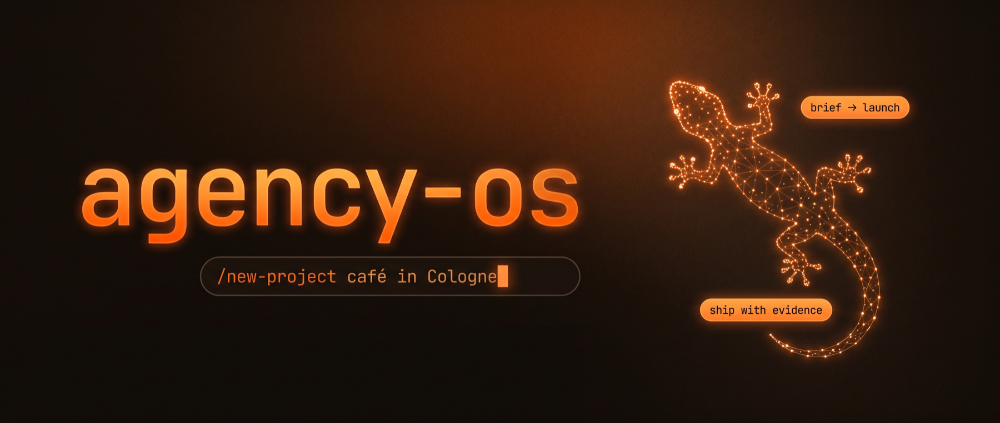
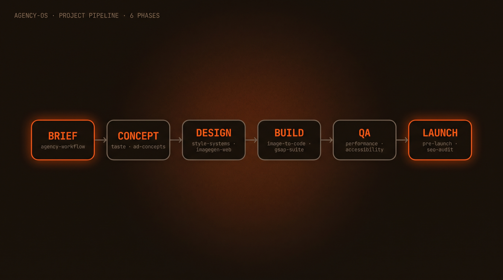
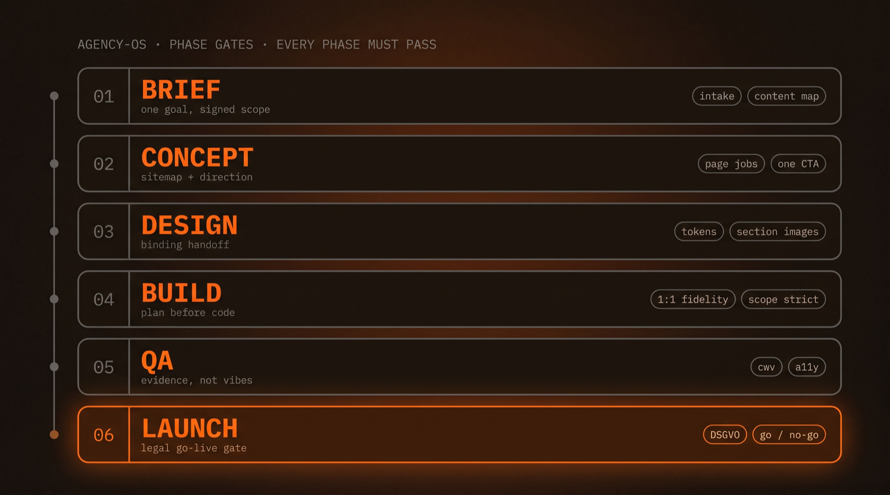
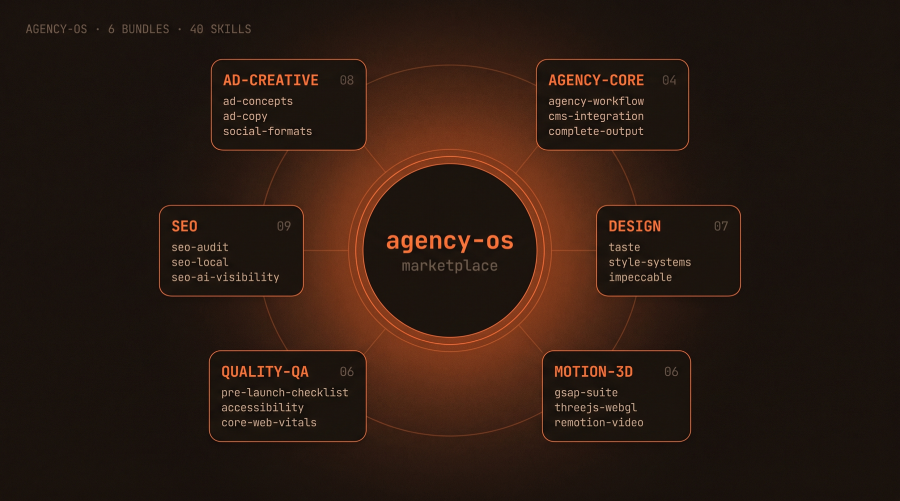

<p align="center">
  
</p>

# agency-os: The Agency Toolkit for Claude Code

**agency-os is an open-source plugin marketplace for [Claude Code](https://docs.anthropic.com/en/docs/claude-code) built for web & advertising design agencies.** It packages 40 skills, 9 commands, and 17 specialist agents into 6 installable bundles that cover the entire agency lifecycle — from the first client call to the legal go-live gate and the monthly retainer loop. One workflow router keeps every project on rails: **BRIEF → CONCEPT → DESIGN → BUILD → QA → LAUNCH → MAINTAIN.**

[](https://github.com/gekkos-tech/agency-os/actions/workflows/validate.yml)
[](LICENSE)
[](https://docs.anthropic.com/en/docs/claude-code/plugins)
[](https://github.com/gekkos-tech/agency-os/releases)
[](#the-six-bundles)
[](#the-six-bundles)
[](https://github.com/gekkos-tech)

> Built by an agency, for agencies. Everything here runs in real client production —
> bundled from the best open-source skills (fully attributed, original licenses kept)
> plus original skills written for agency work.

---

## Table of contents

- [What is this?](#what-is-this)
- [Quick start](#quick-start)
- [The project pipeline](#the-project-pipeline)
- [Phase gates](#phase-gates)
- [The six bundles](#the-six-bundles)
- [Commands](#commands)
- [Agents](#agents)
- [Walkthrough: a real project](#walkthrough-a-real-project)
- [Bring your own designs](#bring-your-own-designs)
- [FAQ](#faq)
- [Recommended companion plugins](#recommended-companion-plugins)
- [Credits](#credits)
- [Contributing](#contributing)
- [License](#license)

---

## What is this?

If you build websites or run ad campaigns for clients with Claude Code, you have
probably collected skills — a GSAP skill here, an SEO skill there, a design skill
from a blog post. Two problems show up fast:

1. **Trigger chaos.** With 31 separate SEO skills installed, "do an SEO audit"
   fires a random one. With 8 GSAP skills, nobody knows which loads.
2. **No process.** Skills are ingredients, not a kitchen. Nothing connects the
   client brief to the design, the design to the build, the build to the launch.

agency-os fixes both:

- **Consolidation with trigger discipline.** Every skill description states what
  it does *and what it does not do* — and names the sibling skill that covers the
  neighboring case. "SEO audit" hits exactly one skill. Every time.
- **A workflow spine.** The `agency-workflow` router walks every client project
  through six phases with hard exit gates, loading the right specialist skill at
  the right moment — automatically.

You install only the bundles you need. Each is a standard Claude Code plugin.

---

## Quick start

**1. Add the marketplace** (one time, inside Claude Code):

```
/plugin marketplace add gekkos-tech/agency-os
```

**2. Install bundles** — all six, or just what you need:

```
/plugin install agency-core@agency-os
/plugin install design-foundation@agency-os
/plugin install motion-3d@agency-os
/plugin install quality-qa@agency-os
/plugin install seo-marketing@agency-os
/plugin install ad-creative@agency-os
```

**3. Start your first project** (new session so the plugins load):

```
/new-project Café in Cologne, modern-minimalist, online reservations
```

That's it. Claude runs the client intake, writes `docs/brief.md`, and tells you
what the next phase needs. No configuration, no API keys, no accounts.

> **Minimal install:** if you only want the workflow, `agency-core` alone works —
> it degrades gracefully and tells you which specialist bundles would help.

---

## The project pipeline

<p align="center">
  
</p>

`agency-workflow` (in agency-core) is a **router**: it detects which phase your
project is in, loads the matching specialist skills, and refuses to advance until
the phase's exit gate passes. Here is what each phase actually does:

| Phase | What happens | What you get | Specialists loaded |
|---|---|---|---|
| **1 · BRIEF** | Client intake interview — goal, audience, scope, content, constraints, taste anchors | `docs/brief.md` the client could sign | — (built into the router) |
| **2 · CONCEPT** | Sitemap, a job + narrative for every page, creative direction, conversion path | `docs/concept.md` | `taste`, `awesome-design-md`, `ad-concepts` |
| **3 · DESIGN** | Commit to ONE style system, generate one reference image per section, assemble the binding handoff | `design/` folder: tokens + section images + notes | `style-systems`, `ui-ux-pro-max`, `imagegen-web`, `brandkit` |
| **4 · BUILD** | Plan before code. Implement the handoff 1:1 — the handoff wins every argument | Working code, per-increment file lists | `image-to-code`, `gsap-suite`, `interface-polish`, `karpathy-guidelines` |
| **5 · QA** | Evidence-based verification: function, fidelity, performance, accessibility | `docs/qa-report.md` | `performance`, `core-web-vitals`, `accessibility`, `webapp-testing` |
| **6 · LAUNCH** | Legal + technical go-live gate, SEO baseline, cutover plan, handover | `docs/launch-checklist.md` with GO/NO-GO | `pre-launch-checklist`, `seo-audit`, `social-formats` |
| **7 · MAINTAIN** | The post-launch loop: drift checks after deploys, monthly CWV/function re-tests, client reports | `docs/reports/YYYY-MM.md` per cadence | `seo-audit` (drift), `core-web-vitals`, `webapp-testing` |

Every project also carries a **`docs/project-state.md`** — phase, gate status,
blockers with owners, who owes what, and the single next step. The router
updates it at every phase end; `/status` reads it back. That's how a project
survives session boundaries and teammate handoffs.

Two principles run through everything:

- **The handoff is the truth.** Once `design/` exists, no skill regenerates
  colors, typography, or layout. Quality skills review; they don't redesign.
- **Plan before code.** Every build increment states what will be built, from
  which design source, touching which files — before any code is written.

## Phase gates

<p align="center">
  
</p>

Each phase ends with a checklist that must pass. A few examples of what the
gates catch: a brief with three "primary" goals (force-ranked to one), a page
with no CTA, a handoff a developer couldn't build from, a form that submits but
never emails anyone, and a site about to launch with staging `noindex` still set.

---

## The six bundles

<p align="center">
  
</p>

### agency-core — the spine

The workflow router plus code-discipline guards. Install this first.

| Skill | What it does |
|---|---|
| `agency-workflow` | Routes BRIEF → CONCEPT → DESIGN → BUILD → QA → LAUNCH → MAINTAIN with per-phase references, exit gates, and the project-state file |
| `complete-output` | Bans placeholder patterns ("// rest stays the same"), enforces complete deliverables, clean split protocol |
| `karpathy-guidelines` | Behavioral guardrails against common LLM coding mistakes — surgical changes, surfaced assumptions |
| `cms-integration` | Which CMS (if any): decision tree + integration patterns for Payload, Sanity, Storyblok, Strapi, Decap, headless WordPress — schema modeled from the design handoff, editor-proof constraints, handover checklist |

Commands: [`/new-project`](#commands) · [`/handoff`](#commands) · [`/proposal`](#commands) · [`/status`](#commands) · [`/monthly-report`](#commands)

### design-foundation — the quality layer

Everything that makes output look designed instead of generated.

| Skill | What it does |
|---|---|
| `ui-ux-pro-max` | Searchable design intelligence: 50+ styles, 161 palettes, 57 font pairings, 99 UX guidelines, 10 stacks |
| `taste` | Anti-generic creative direction from a brief — reads the room before choosing an aesthetic |
| `impeccable` | Command-driven design workflow: craft, audit, polish, animate, harden |
| `style-systems` | Commits a project to ONE of four complete style systems (minimalist-editorial, brutalist-industrial, soft-depth, product-modern) — token-level, never mixed |
| `redesign` | Audit-first premium upgrade of existing sites without breaking functionality |
| `interface-polish` | The last 10%: hover states, easing, layered shadows, optical alignment, tabular numbers |
| `awesome-design-md` | 74 real brand design systems (Linear, Stripe, Apple…) as ground-truth DESIGN.md references |

Command: `/design-review` + `design-reviewer` agent

### motion-3d — everything that moves

| Skill | What it does |
|---|---|
| `gsap-suite` | The 8 official GSAP skills in one: core tweens, timelines, ScrollTrigger, plugins, React, Vue/Svelte, utils, performance |
| `threejs-webgl` | Three.js scenes, WebGL/WebGPU, configurators, 3D visualization |
| `react-three-fiber` | Declarative 3D in React |
| `lottie-animations` | After-Effects vector animation on the web |
| `rive-interactive` | State-machine animation with runtime interactivity |
| `remotion-video` | Programmatic video rendering in React (not browser animation — actual video files) |

### quality-qa — ship with evidence

| Skill | What it does |
|---|---|
| `performance` / `core-web-vitals` | Load-time optimization; LCP, INP, CLS diagnosis and fixes |
| `accessibility` | WCAG 2.2 audits and fixes |
| `best-practices` | Security, compatibility, code quality |
| `webapp-testing` | Playwright-driven functional testing of local web apps |
| `pre-launch-checklist` | **The German/EU go-live gate**: DSGVO, Impressum (§5 DDG), cookie consent (TDDDG), BFSG accessibility, self-hosted fonts — plus SSL, redirects, 404, OG tags, sitemap, forms. Legal items are hard blockers |

Command: `/pre-launch` + `qa-auditor` agent

### seo-marketing — the consolidated claude-seo powerhouse

[claude-seo](https://github.com/AgriciDaniel/claude-seo) v2.2.0, consolidated
from 31 skills into 9 so triggers never collide — plus 15 specialist subagents
for parallel audit delegation.

| Skill | What it does |
|---|---|
| `seo-audit` | **The single audit entry point**: crawls up to 500 pages, delegates to specialists, 0-100 health score, action plan, PDF report. Includes single-page audits, drift monitoring, Unlighthouse |
| `seo-technical` | Crawlability, robots, canonicals, redirects + sitemaps, hreflang, image SEO |
| `seo-content` | E-E-A-T, content briefs, SERP-overlap topic clustering, programmatic SEO, SXO |
| `seo-schema` | JSON-LD detection, validation, generation |
| `seo-local` | Google Business Profile, NAP, citations, map pack + geo-grid maps intelligence |
| `seo-ai-visibility` | GEO: AI Overviews, ChatGPT search, Perplexity citations, llms.txt, FLOW framework |
| `seo-competitor` | "X vs Y" and alternatives pages with comparison schema |
| `seo-backlinks` | Link profiles via free sources (Common Crawl) — no paid API needed |
| `seo-ecommerce` | Product schema at catalog scale, Google Shopping, marketplace intelligence |

No API keys required for any of it. If you *have* keys (DataForSEO, Ahrefs,
Google APIs…), the upstream [claude-seo](https://github.com/AgriciDaniel/claude-seo)
marketplace adds those power-ups.

### ad-creative — from idea to export

| Skill | What it does |
|---|---|
| `ad-concepts` | Campaign ideation: always exactly 3 distinct routes (claim, hook, visual idea, channel) built on AIDA/PAS/JTBD/4U + a hook formula bank |
| `ad-copy` | Performance copywriting in German AND English: headline systems, funnel-stage CTA library, A/B/C protocol with hypotheses, Du/Sie decision tree, UWG/HWG compliance notes |
| `social-formats` | Platform specs for Meta/IG, TikTok, LinkedIn, YouTube — verified July 2026 — plus a master-creative adaptation workflow with safe zones |
| `landingpage-cro` | 8-section conversion narrative, message-match rule, friction audit, DACH trust elements |
| `brandkit` | Art direction for AI-generated brand boards, logo sheets, identity decks |
| `imagegen-web` | One reference image per page section — the design source developers rebuild from |
| `imagegen-mobile` | Premium app-screen concepts with multi-screen token consistency |
| `image-to-code` | Faithful implementation FROM design images: deep analysis pass, fidelity rules, verification against every source image |

Commands: `/campaign` · `/adapt-formats`

---

## Commands

| Command | Bundle | What it does |
|---|---|---|
| `/new-project <brief>` | agency-core | Kick off a client project — runs the BRIEF phase |
| `/handoff [path\|verify]` | agency-core | Assemble the binding design handoff from your assets, or audit it for completeness |
| `/proposal [terms]` | agency-core | Client proposal from the brief: scope, phases, deliverables, assumptions, out-of-scope list |
| `/status [path]` | agency-core | Where does the project stand? Phase, gates, blockers with owners, the single next step |
| `/monthly-report <url>` | agency-core | The MAINTAIN loop: drift check, CWV spot-check, function re-test, client report |
| `/design-review [target]` | design-foundation | Structured review: verdict, fidelity deviations, findings by severity, quick wins |
| `/pre-launch <url>` | quality-qa | The full legal + technical go-live gate with GO/NO-GO verdict |
| `/campaign <client + goal>` | ad-creative | 3 campaign routes with different emotional registers |
| `/adapt-formats <asset>` | ad-creative | Format matrix + adaptation plan for every placement in your media plan |

## Agents

Two review agents ship with the bundles — `design-reviewer` (design-foundation)
and `qa-auditor` (quality-qa) — plus 15 SEO specialists (seo-marketing) that
`seo-audit` dispatches in parallel: technical, content, schema, performance,
visual, local, maps, GEO, backlinks, clustering, SXO, drift, e-commerce, FLOW,
sitemap.

---

## Walkthrough: a real project

What actually happens when you type:

```
/new-project Café in Cologne, modern-minimalist, online reservations
```

1. **BRIEF** — Claude extracts what it already knows (business: café; market:
   Cologne; scope hint: reservations), asks the missing intake questions in one
   batch (goal ranking, content inventory, taste anchors), and writes
   `docs/brief.md` — in German, because the client is German.
2. **CONCEPT** — sitemap (Home, Menü, Reservierung, Über uns, Kontakt), a
   narrative per page, creative direction via `taste` ("warm minimalism, no
   generic café clichés"), one CTA per page (Reservieren).
3. **DESIGN** — `style-systems` commits to *minimalist-editorial*, tokens get
   written down, `imagegen-web` produces one reference image per section, and
   `/handoff` assembles the binding `design/` folder.
4. **BUILD** — `image-to-code` implements section by section against the images;
   `gsap-suite` adds the scroll entrance; scope stays strict.
5. **QA** — forms actually submit, Core Web Vitals measured, keyboard path
   tested; `docs/qa-report.md` written.
6. **LAUNCH** — `/pre-launch` runs the DSGVO/Impressum/consent/BFSG gate
   (reservation systems are BFSG-relevant!), SEO baseline via `seo-audit`,
   cutover plan, handover doc. GO.

## Bring your own designs

Already have designs (from Figma, a designer, or a previous Claude session)?
They become the **binding source of truth** — nothing gets regenerated:

```
/new-project Café in Cologne, online reservations.
Designs are in ./designs/ — they are binding.
```

or, mid-project:

```
/handoff ./designs/
```

The DESIGN phase then skips generation entirely: tokens are *extracted* from
your files into `design/tokens.md`, your images become `design/sections/`, and
BUILD implements them 1:1 — with a verification pass against every source image.

---

## FAQ

**Do I need all six bundles?**
No. They're independent plugins. `agency-core` alone gives you the workflow;
it detects which specialist bundles are installed and degrades gracefully.

**Does this cost anything? Do I need API keys?**
The marketplace is free (MIT) and nothing in it requires an API key or account.
Skills that would need paid APIs were deliberately left out (linked under
[companions](#recommended-companion-plugins) instead).

**Why is there German legal stuff in my QA bundle?**
Because forgetting Impressum, cookie consent, or BFSG accessibility is how
German agencies get Abmahnungen. If you don't serve DACH/EU clients, those
checklist items simply won't apply — the technical half (SSL, redirects,
sitemap, OG tags) is universal. Note: the checklist is a practical aid, **not
legal advice**.

**Does it work in German?**
Yes — triggers respond to German phrasing ("Neues Projekt", "Kampagne für",
"SEO-Audit"), client-facing documents follow the client's language, and
`ad-copy` writes German and English copy natively (including the Du/Sie
decision).

**How is this different from installing the upstream skills directly?**
Three things: consolidation (31 SEO skills → 9, 8 GSAP skills → 1 — so triggers
don't collide), the workflow spine connecting them, and curation (every bundle
skill works without keys, carries its license, and has a description that says
when *not* to use it).

**Can I use only the SEO part? Only the design part?**
Yes — that's the point of bundles. Each plugin stands alone.

**Something triggered wrong or didn't trigger. What do I do?**
Open an issue with the exact prompt you typed. Trigger descriptions are the
most-tuned part of this repo and we treat misfires as bugs.

---

## Recommended companion plugins

Not bundled (different licenses or they need accounts/keys), but they pair well:

- [frontend-design](https://github.com/anthropics/claude-code/tree/main/plugins/frontend-design) — Anthropic's official frontend design plugin
- [anthropics/skills](https://github.com/anthropics/skills) — official skills incl. document handling
- [Vercel plugin](https://vercel.com/docs) — deploys, envs, previews from Claude Code
- [claude-seo](https://github.com/AgriciDaniel/claude-seo) — the upstream SEO marketplace; adds API-powered extensions (DataForSEO, Ahrefs, SE Ranking, Profound, Bing, Firecrawl, Google APIs, image generation)

## Credits

agency-os stands on excellent open-source work. Bundled skills keep their
original licenses and LICENSE files — full details in
[THIRD_PARTY_LICENSES.md](THIRD_PARTY_LICENSES.md):

- [ui-ux-pro-max](https://github.com/nextlevelbuilder/ui-ux-pro-max-skill) — Next Level Builder (MIT)
- [taste](https://github.com/Leonxlnx/taste-skill) — Leonxlnx (MIT)
- [impeccable](https://github.com/pbakaus/impeccable) — Paul Bakaus (Apache-2.0)
- [awesome-design-md](https://github.com/VoltAgent/awesome-design-md) — VoltAgent (MIT)
- [GSAP skills](https://github.com/greensock/gsap-skills) — GreenSock/Webflow (MIT)
- [claude-seo](https://github.com/AgriciDaniel/claude-seo) — Daniel Agrici and Pro Hub Challenge contributors (MIT); FLOW framework prompts (CC BY 4.0)
- [web-quality-skills](https://github.com/addyosmani/web-quality-skills) — Addy Osmani (MIT)
- [webapp-testing](https://github.com/anthropics/skills) — Anthropic (Apache-2.0)
- [claudedesignskills](https://github.com/freshtechbro/claudedesignskills) — freshtechbro (MIT)
- karpathy-guidelines — community skill (MIT), inspired by Andrej Karpathy's writing

Original skills (agency-workflow, style-systems, redesign, interface-polish,
complete-output, remotion-video, brandkit, imagegen-web/mobile, image-to-code,
ad-concepts, ad-copy, social-formats, landingpage-cro, pre-launch-checklist)
© 2026 GEKKOS Tech, MIT.

## Contributing

Issues and PRs welcome. Ground rules:

1. **Licensing first** — third-party content only with a clear MIT/Apache/CC
   license, original LICENSE bundled, entry in THIRD_PARTY_LICENSES.md.
2. **Trigger discipline** — new skill descriptions must state when to use
   them AND which sibling skill covers the neighboring case.
3. **Skill format** — SKILL.md < 500 lines, details in `references/`,
   valid frontmatter (`name` = directory name).
4. **CI must stay green** — every push runs `claude plugin validate --strict`
   plus `scripts/validate_frontmatter.py` (frontmatter, manifests, reference
   links). Behavioral eval cases live in `evals/` and run locally via
   `claude plugin eval` (early access).

## License

MIT © 2026 [GEKKOS Tech](https://github.com/gekkos-tech). Bundled third-party
skills retain their original licenses — see
[THIRD_PARTY_LICENSES.md](THIRD_PARTY_LICENSES.md).
